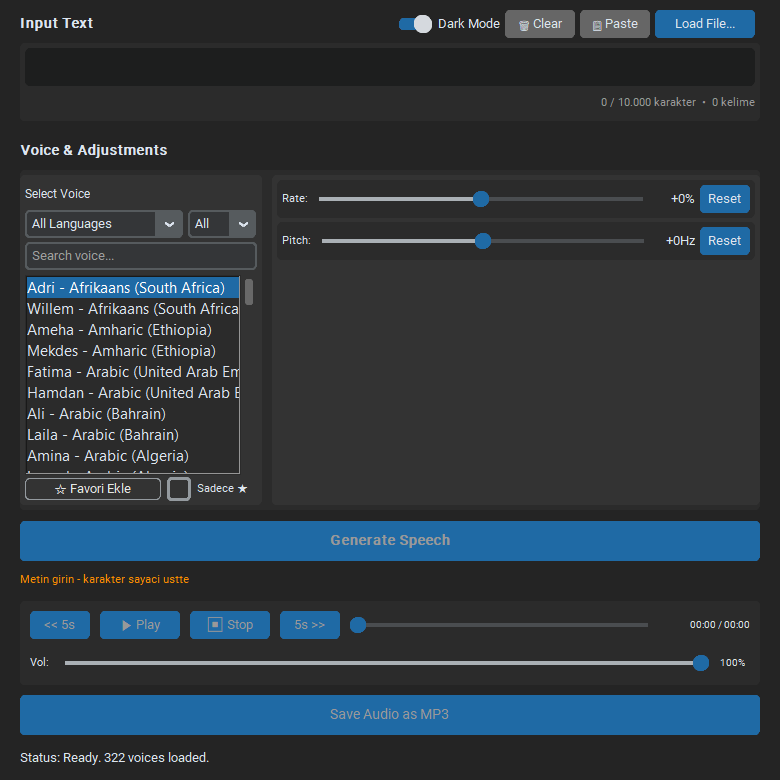
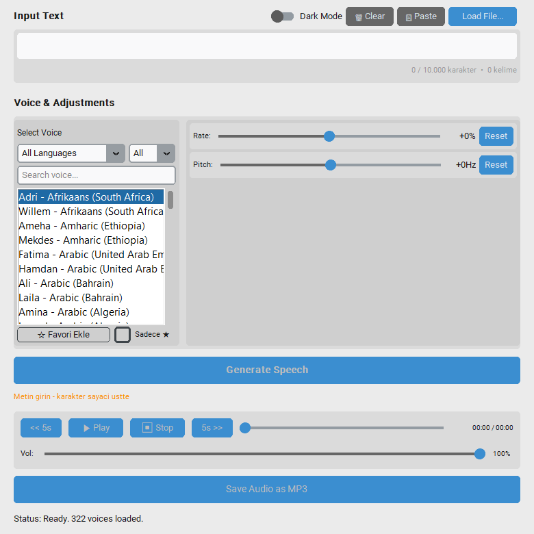

# Edge TTS GUI

A desktop app that turns text into natural-sounding speech using Microsoft Edge's free online TTS service. Type or load text, pick one of 300+ voices, tweak rate/pitch, listen, and save as MP3.




## Features

- **Text input** — type directly, paste from clipboard, or load `.txt` / `.srt` subtitle files (dialogue is extracted automatically)
- **300+ voices** — full Microsoft Edge voice list with live search, language filter, gender filter, and ★ favorites (saved between sessions)
- **Scrollable voice list** — mouse-wheel friendly list that handles hundreds of voices (works on Windows, macOS, and Linux)
- **Rate & pitch controls** — sliders with reset buttons, plus mouse-wheel fine-tuning
- **Audio playback** — play / pause / resume / stop, ±5s seek buttons, draggable progress bar with time display, volume slider
- **Save as MP3** — one click, with a smart filename suggested from your text
- **Character & word counter** — live count with a color warning as you approach the ~10,000 character service limit
- **Dark / Light mode** — follows your system theme, with a manual override switch
- **Helpful status bar** — always tells you why a button is disabled (e.g. "Enter text", "Select a valid voice")

## Requirements

- **Python** 3.10 or higher (3.8+ may work, 3.10+ recommended)
- **pip** (ships with Python)
- **Internet connection** (required — voices and speech come from the Edge TTS service)
- **OS audio backend** for `just_playback`:
  - Windows: works out of the box
  - Linux (Debian/Ubuntu): `libgstreamer1.0-0 gstreamer1.0-plugins-{base,good,bad,ugly} gstreamer1.0-libav ffmpeg`
  - Linux (Fedora): `gstreamer1-plugins-{base,good,bad-free,ugly} gstreamer1-plugin-libav ffmpeg`
  - macOS: `brew install ffmpeg` (recommended)

## Quick start

```bash
git clone https://github.com/Ashfield-dev/edge-tts-gui.git
cd edge-tts-gui

python -m venv venv
# Windows:
.\venv\Scripts\activate
# macOS / Linux:
source venv/bin/activate

pip install -r requirements.txt
python app.py
```

No install needed beyond that — favorites are stored in your user profile (`%APPDATA%\EdgeTTS-GUI` on Windows, `~/.config/EdgeTTS-GUI` on Linux/macOS), so the app folder stays clean.

## Usage

1. **Enter text** — type, paste (`📋 Paste`), or `Load File...` (`.txt` or `.srt`).
2. **Pick a voice** — search, filter by language/gender, or tap `☆` to favorite the voices you use most.
3. **Adjust (optional)** — Rate and Pitch sliders; `Reset` returns to default.
4. **Generate Speech** — creates a temporary MP3 via the Edge TTS service.
5. **Listen** — `▶ Play / ⏸ Pause / ⏹ Stop`, seek with the `<< 5s` / `5s >>` buttons or drag the progress bar.
6. **Save** — `Save Audio as MP3` (enabled once playback is stopped).

## Build a Windows .exe

The `.spec` files are intentionally git-ignored, so build directly from `app.py`:

```powershell
pip install pyinstaller
pyinstaller --noconfirm --onefile --windowed --name EdgeTTS-GUI `
  --hidden-import just_playback --hidden-import _ma_playback `
  --hidden-import tinytag --hidden-import cffi --hidden-import _cffi_backend `
  --collect-all customtkinter --collect-all edge_tts --collect-all certifi `
  app.py
# -> dist\EdgeTTS-GUI.exe
```

## Troubleshooting

| Symptom | Fix |
|---|---|
| `'just_playback' not found` | `pip install just_playback` **inside the activated venv** |
| `Error loading voices` / `Error generating audio` | Check your internet connection; the Edge service is occasionally down |
| No sound on Linux/macOS | Install the GStreamer/FFmpeg packages listed under Requirements |
| No sound on Windows | Update audio drivers; installing FFmpeg and adding it to `PATH` helps in rare cases |
| `PermissionError` deleting temp file | The player sometimes holds the file briefly — restarting the app resolves it |
| `python`/`pip` not found | Reinstall Python with **"Add Python to PATH"** checked (Windows), or use `python3`/`pip3` |

## Tech stack

Python · [CustomTkinter](https://github.com/TomSchimansky/CustomTkinter) · [edge-tts](https://github.com/rany2/edge-tts) · [just_playback](https://github.com/cheofusi/just_playback) · PyInstaller

## Contributing

Issues and pull requests are welcome. Please keep changes small and in the existing code style; if you touch the UI, attach a screenshot in both dark and light mode.

## License

MIT — see [LICENSE](LICENSE) for details. Not affiliated with Microsoft; the TTS service belongs to its respective owners.
